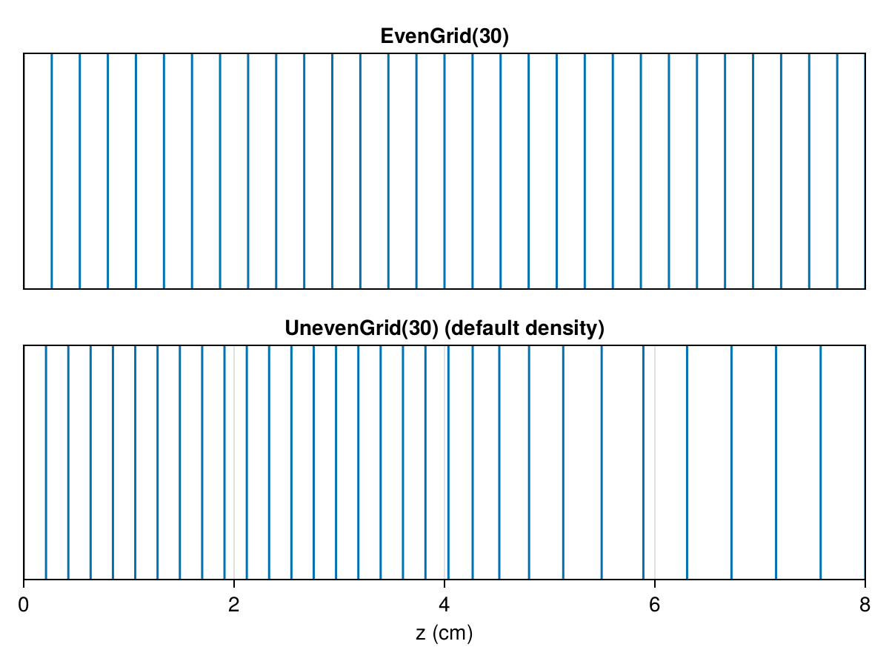

# Grid Generation

HallThruster.jl supports both regular and irregular grids. Grids are passed to the `run_simulation` function via the `grid` keyword argument, or as a field of a `SimParams` struct.

To create an evenly-spaced grid with `ncells` cells, we construct an `EvenGrid`

```julia
grid = EvenGrid(ncells)
```

Alternatively, we could produce an irregular grid using 

```julia
grid = UnevenGrid(ncells)
```

The `UnevenGrid` consists of a fine region from $z = 0$ to $z = 1.5 L_{ch}$, and a coarse region beyond that, with a smooth transition between them. For example, if the domain is (0 cm, 8 cm) and the thruster channel length is 2.5 cm, `EvenGrid` and `UnevenGrid` options produce the grids below, respectively. The channel exit plane is shown with a dashed red line.



