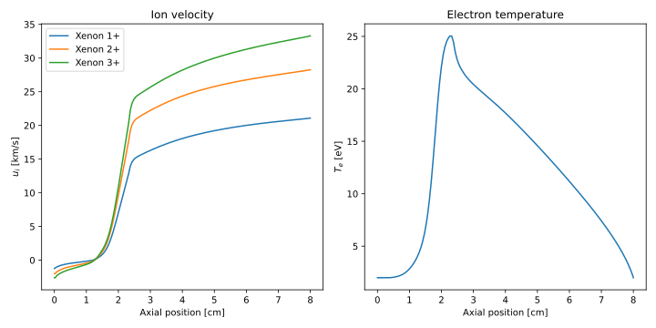

# Run a simulation from python

```@meta
CurrentModule = HallThruster
```

`HallThruster` comes bundled with a script that enables users to run simulations from python.
To use this script, you will first need to install `HallThruster` as described in the [home page](../index.md) or  [tutorial](../tutorials/simulation.md).

Next, launch `Julia` and activate the environment in which you have installed `HallThruster`.
Check `HallThruster.PYTHON_PATH` to see the absolute path to the python script on your machine.

```@docs
PYTHON_PATH
```

Next, open a python script and import the path returned by `python_script_path()`.

```python
import sys

sys.path.append("/Users/archermarks/src/HallThruster/python")

import hallthruster as het
```

With `HallThruster` imported, you can create the inputs to your simulation.
These are exactly identical to those used for the [JSON interface](../howto/json.md), so we will not belabor them here.
You can either use a dictionary or a path to a JSON file.

As in the Julia version, we first create a [`config`](../reference/config.md#Config) dict to hold geometric and plasma properties.

```python
config = {
    "thruster": {
        "name": "SPT-100",
        "geometry": {
            "channel_length": 0.025,
            "inner_radius": 0.0345,
            "outer_radius": 0.05,
        },
        "magnetic_field": {
            "file": "bfield_spt100.csv"
        }
    },
    "discharge_voltage": 300.0,
    "anode_mass_flow_rate": 5e-6,
    "domain": (0.0, 0.08),
    "anom_model": {
        "type": "TwoZoneBohm",
        "c1": 0.00625,
        "c2": 0.0625,
    },
    "ncharge": 3
}
```

Next, we create a [`simulation`](../reference/simparams.md#SimParams) dict to hold timestepping properties.

```python
simulation = {
    "dt": 5e-9,
    "adaptive": True,
    "grid": {
        "type": "EvenGrid",
        "num_cells": 100,
    },
    "num_save": 100,
    "duration": 1e-3,
}
```

Lastly, we create a [`postprocess`](../reference/postprocessing.md#Postprocess) dict to hold the output file and desired output format.

```python
postprocess = {
    "output_file": "output.json",
    "save_time_resolved": False,
    "average_start_time": 5e-4,
}
```

With these created, we can run our simulation.
Note that if we already have a JSON file with these inputs, we can pass the json path instead of the dictionary.

```python
input = {"config": config, "simulation": simulation, "postprocess": postprocess}

solution = het.run_simulation(input, jl_env = ".")
```
Here, we have provided the keyword argument `jl_env` to tell Python where it should look for `HallThruster`.
This should be the directory in which you have a `Project.toml` specifying `HallThruster` as a dependency.
If left blank, the script will assume that you want to use the global environment.

The `run_simulation` function will return a solution output prepared according to `postprocess`.
If `postprocess.output_file` is not blank, the solution will also be written to the specified file in addition to being returned from the function.

## Extracting results

We can call `solution.keys` to examine the output.
```python
>>> solution.keys()
dict_keys(['input', 'output'])
```

As in the JSON interface, we duplicate the inputs used to run the simulation into `input`, and put the results of the simulation in `output`.

```python
>>> solution['input'].keys()
dict_keys(['config', 'simulation', 'postprocess'])

>>> solution['output'].keys()
dict_keys(['retcode', 'error', 'average'])
```
If we had requested time-resolved output, `output` would have a `frames` field in addition to `average`.
We will first want to examine the return code to see if the simulation completed successfully.

```python
>>> output = solution['output']
>>> output['retcode']
'success'
```

The simulation outputs can be examined and plotted similarly to the julia interface.
The fields of each frame are as follows:
```python
>>> output['average'].keys()
dict_keys(['thrust', 'discharge_current', 'ion_current', 'mass_eff', 'voltage_eff', 'current_eff', 'divergence_eff', 'anode_eff', 't', 'z', 'nn', 'ni', 'ui', 'niui', 'B', 'ne', 'ue', 'potential', 'E', 'Tev', 'pe', 'grad_pe', 'nu_en', 'nu_ei', 'nu_anom', 'nu_class', 'mobility', 'channel_area'])
```
Here's an example showing how to analyze both ion and electron quantities.

```python
import matplotlib.pyplot as plt
import numpy as np

f, axes = plt.subplots(1, 2, figsize = (10,5))
xlabel = 'Axial position [cm]'
axes[0].set_xlabel(xlabel)
axes[1].set_xlabel(xlabel)
axes[0].set_ylabel('\$u_i\$ [km/s]')
axes[1].set_ylabel('\$T_e\$ [eV]')
axes[0].set_title('Ion velocity')
axes[1].set_title('Electron temperature')

config = solution['input']['config']
propellant = config['propellant']
avg = solution['output']['average']
z_cm = np.array(avg['z']) * 100

for Z in range(solution['input']['config']['ncharge']):
    ui_km_s = np.array(avg['ui'][Z]) / 1000
    axes[0].plot(z_cm, ui_km_s, label = f"{propellant} {Z+1}+")

axes[1].plot(z_cm, avg['Tev'])
axes[0].legend()
plt.tight_layout()

plt.show()
```

This produces the following plot:

