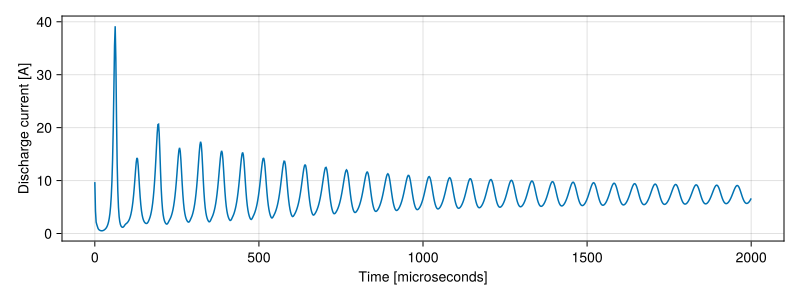
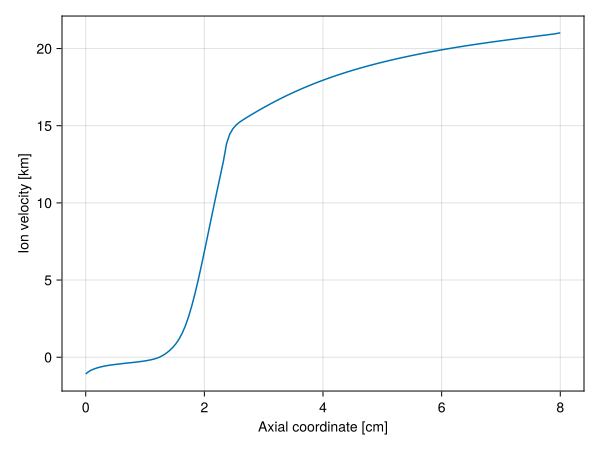

# Running a simulation 

```@meta
CurrentModule = HallThruster
```

In this tutorial, we will take you through running a simulation of an SPT-100 Hall thruster in `HallThruster`.
Along the way, you will learn how to
- install the `HallThruster` package
- configure simulation options 
- run a simulation
- examine the results

We assume that you have a basic familiarity with the Julia programming language, and have installed Julia following the instructions on the [Julia website](https://github.com/JuliaLang/juliaup).
If this does not apply to you, you will want to familiarize yourself with Julia using the [Getting started](https://docs.julialang.org/en/v1/manual/getting-started/) section of the Julia manual.
We also assume you know what a Hall thruster is and have some understanding of their operation.

## Install

First, open Julia and type ']' to enter the Package REPL (**R**ead-**E**valuate-**P**rint **L**oop)
You should see the following prompt (the version may differ depending on your default Julia version).

```julia
(@v1.10) pkg>
```

To install `HallThruster` io your global environment, simply type 

```julia
(@v1.10) pkg> add HallThruster
```

This will download and precompile `HallThruster` and all of its dependencies.
This works, but it is not always desirable to install packages to your global environment.
Instead, it is common to have different packages loaded depending on your specific project.
To do this, first create a new folder, which we'll call `hallthruster_tutorial`.
Change directories into this folder, open Julia, and enter the package REPL.
Type 

```julia
(@v1.10) pkg> activate .
```

to activate `hallthruster_tutorial` as its own environment.
You should see `v1.10` (or whatever version) be replaced with the name of your current folder.
From there, you can install packages as normal, i.e.

```julia
(hallthruster_tutorial) pkg> add HallThruster
```

This will create a file called `Project.toml`, which tracks the dependencies of the current environment.
Environments are great for ensuring reproducability and portability of your Julia code.
For example, if you want to send a script to a friend, sending the `Project.toml` file of your environment means they will be able to automatically download all of the packages you used in your script.
Using one environment per project instead of the global environemnt means that your friend doesn't also have to download every single other package you happened to have installed, or manually install all of the packages you use in your script.

Once `HallThruster` has been installed, we're ready to begin writing and running our simulation code.
Create a new file, perhaps called `hallthruster_tutorial.jl` and open it in your favorite text editor.

## Configure

The first thing we need to do is tell your script that we want to use `HallThruster`.
To do this, add the following to the beginning of your script.

```julia
using HallThruster: HallThruster as het
```

This tells Julia that you want access to the `HallThruster` module.
Since we will be accessing a lot of code in `HallThruster`, we also tell Julia that we want to refer to `HallThruster` as a shorter name, in this case `het` for **H**all-**e**ffect **t**hruster.
You can leave this out, or change `het` to whatever you want.

We need to tell `HallThruster` about what kind of simulation we want to run.
This is the job of a [`Config`](@ref).
A `Config` struct contains most of the geometric, physical, and numerical information that HallThruster.jl needs in order to simulate a Hall thruster.
There are a lot of options in a `Config`, but we will only use a few of them in this tutorial.
You can read a full listing of these parameters, their effects, and their defaults on the [Configuration](../reference/config.md) page.

Only four parameters are absolutely _required_ in a `Config`.
These are

1. the thruster we want to simulate,
2. the discharge voltage,
3. the neutral mass flow rate at the anode,
4. the size of the simulation domain.

We'll begin by constructing a [`Thruster`](@ref)
A `Thruster` has four components -- a name, a geometry, a magnetic field, and an optional flag that says whether the thruster is magnetically-shielded.
The geometry is defined using a [`Geometry1D`](@ref) struct, which requires to specify the length of the discharge channel in combination with the inner and outer channel radii.
For the SPT-100, a `Geometry1D` can be constructed like so:

```jldoctest; output=false
using HallThruster: HallThruster as het

# All units are SI unless explicitly specified
geom = het.Geometry1D(
    channel_length = 0.025,
    inner_radius = 0.0345,
    outer_radius = 0.05,
)

# output

HallThruster.Geometry1D(0.025, 0.0345, 0.05, 0.004114700978039233)
```

Note that all units are SI unless a unit is explicitly listed in the parameter name.
As a result, `Geometry1D` expects dimensions in meters.
If you would like to use explicit units, you can install and load either [`Unitful`](https://github.com/PainterQubits/Unitful.jl) or [`DynamicQuantities`](https://github.com/SymbolicML/DynamicQuantities.jl), and specify dimensions as follows

```@meta
DocTestSetup = quote
    using HallThruster: HallThruster as het
    using Unitful

    geom = het.Geometry1D(
        channel_length = 2.5u"cm",
        inner_radius = 34.5u"mm",
        outer_radius = 0.05u"m",
    )

    include_dirs = [
        joinpath(het.PACKAGE_ROOT, "test", "json")
    ]

    bfield = het.load_magnetic_field("bfield_spt100.csv"; include_dirs)

    thruster = het.Thruster(
        name = "SPT-100",
        geometry = geom,
        magnetic_field = bfield
    )

    config = het.Config(
        thruster = thruster,
        domain = (0.0, 0.08),
        discharge_voltage = 300.0,
        anode_mass_flow_rate = 5e-6,
        propellant = het.Xenon,
    )

    simparams = het.SimParams(
        grid = het.EvenGrid(100),   # an evenly-spaced grid with 100 cells
        dt = 5u"ns",                  # a base timestep of 5 nanoseconds
        duration = 1u"ms",            # run the simulation for one millisecond of simulated time
        num_save = 1000,            # save 1000 frames of output
    )
end
```

```jldoctest; output=false
using HallThruster: HallThruster as het
using Unitful # or `using DynamicQuantities`, if desired

geom = het.Geometry1D(
    channel_length = 2.5u"cm",
    inner_radius = 34.5u"mm",
    outer_radius = 0.05u"m",
)

# output

HallThruster.Geometry1D(0.025, 0.0345, 0.05, 0.004114700978039233)
```

With the `Geometry1D` object constructed, we can turn to specifying the radial magnetic field.
Unsurprisingly, we use a [`MagneticField`](@ref) struct for this.
`MagneticField` has three fields — a filename and two arrays.
The first array (`z`) specifies the axial coordinates (in meters) at which the magnetic field is known.
The second (`B`) provides the magnetic field (in Tesla) at those points.
While we can definitely manually pass these to `MagneticField`, in most cases you will want to pass a file instead.
You can download a sample magnetic field file [here](https://github.com/UM-PEPL/HallThruster.jl/blob/v1.0/test/json/bfield_spt100.csv).

Once you have downloaded the magnetic field file and placed it in your current working directory, you can load it using the [`load_magnetic_field`](@ref) function.

```julia
bfield = het.load_magnetic_field("bfield_spt100.csv")
```

If the magnetic field is in some other directory, you can tell `load_magnetic_field` to look for it using the `include_dirs` argument. 
`HallThruster` will check the provided directories before looking in the present working directory.

```julia
bfield = het.load_magnetic_field(
    "bfield_spt100.csv"; 
    include_dirs = ["/some/directory", "/another/directory"]
)
```

With our geometry and magnetic field specified, we can finally create a `Thruster`.

```jldoctest; output=false
thruster = het.Thruster(
    name = "SPT-100",
    geometry = geom,
    magnetic_field = bfield
)

# output

HallThruster.Thruster("SPT-100", HallThruster.Geometry1D(0.025, 0.0345, 0.05, 0.004114700978039233), HallThruster.MagneticField("bfield_spt100.csv", [0.00023880597014925425, 0.0009552238805970153, 0.002746268656716417, 0.00453731343283582, 0.006208955223880597, 0.007641791044776119, 0.008716417910447763, 0.009791044776119404, 0.010985074626865671, 0.011820895522388061  …  0.06435820895522387, 0.06698507462686568, 0.06985074626865673, 0.07271641791044776, 0.07582089552238806, 0.07976119402985075, 0.08429850746268656, 0.08811940298507463, 0.09170149253731344, 0.09504477611940298], [0.0006769662921348278, 0.0007050561797752805, 0.001014044943820229, 0.001519662921348315, 0.0021376404494382016, 0.002867977528089892, 0.0036264044943820246, 0.00441292134831461, 0.005480337078651688, 0.006266853932584273  …  0.004693820224719109, 0.0043005617977528166, 0.003879213483146078, 0.003514044943820238, 0.003148876404494391, 0.0027837078651685512, 0.0023904494382022586, 0.002109550561797763, 0.0019129213483146217, 0.0017443820224719263]), false)
```

Now, we can set the rest of the options in `Config`.
We'll use a discharge voltage of 300 V, a mass flow rate of 5 milligrams per second, and a domain length of 8 cm.
We will also explicitly specify that the propellant is xenon.

```julia
config = het.Config(
    thruster = thruster,
    domain = (0.0, 0.08),
    discharge_voltage = 300.0,
    anode_mass_flow_rate = 5e-6,
    propellant = het.Xenon,
)
```

As with `Geometry1D`, units may be provided here using `Unitful` or `DynamicQuantities`, e.g

```julia
using Unitful

config = het.Config(
    thruster = thruster,
    domain = (0.0u"cm", 8.0u"cm"),
    discharge_voltage = 300.0u"V",
    anode_mass_flow_rate = 5.0u"mg/s",
    propellant = het.Xenon,
)
```

## Run

Now that we have created a `Config` struct, we can run our simulation.
You might notice that we did not specify a timestep or a grid at any point.
To do this, we make use of the [`SimParams`](@ref) struct.

```jldoctest; output=false
simparams = het.SimParams(
    grid = het.EvenGrid(100),   # an evenly-spaced grid with 100 cells
    dt = 5e-9,                  # a base timestep of 5 nanoseconds
    duration = 1e-3,            # run the simulation for one millisecond of simulated time
    num_save = 1000,            # save 1000 frames of output
)

# output

HallThruster.SimParams{HallThruster.NoController}(HallThruster.GridSpec(:EvenGrid, 100), 5.0e-9, 0.001, 1000, true, true, true, 0.799, 1.0e-10, 1.0e-7, 100, HallThruster.NoController())
```

Here, we specified only four parameters, but `SimParams` has many more options that can be configured.
See the page on [Simulations](../reference/simparams.md) for more details.
These four are:
- The `grid`, which we have set to an `EvenGrid` with 100 cells. We can alternatively use an `UnevenGrid`, which provides more resolution near the discharge channel and less in the plume. More information about these grids can be found on the [Grid generation](../explanation/grid_generation.md) page.
- The base timestep `dt`, in seconds. HallThruster uses adaptive timestepping by default, so typical timesteps will differ from the value provided here, but the base timestep is used in certain cases when the adaptive timestepping scheme gets stuck, or when uniform timestepping is explicitly requested (by passing `adaptive=false` to the `SimParams` struct). We give more detailed explanation of `HallThruster`'s timestepping strategy on the [Timestepping](../explanation/timestepping.md) page.
- The simulation `duration`, in seconds.
- The number of frames we wish to save over the simulation runtime. Each frame captures the state of the simulation at a specific time. These are evenly spaced across `duration`.

As always, units may be specified.

```jldoctest; output=false
simparams = het.SimParams(
    grid = het.EvenGrid(100),   # an evenly-spaced grid with 100 cells
    dt = 5u"ns",                # a base timestep of 5 nanoseconds
    duration = 1u"ms",          # run the simulation for one millisecond of simulated time
    num_save = 1000,            # save 1000 frames of output
)

# output

HallThruster.SimParams{HallThruster.NoController}(HallThruster.GridSpec(:EvenGrid, 100), 5.0e-9, 0.001, 1000, true, true, true, 0.799, 1.0e-10, 1.0e-7, 100, HallThruster.NoController())
```

Finally, we can pass these to the [`run_simulation`](@ref) function, which runs the simulation and returns a [`Solution`](@ref) object.

```jldoctest; filter = r"[0-9\.]+ seconds\."
solution = het.run_simulation(config, simparams)

# output

[ Info: Simulation exited at t = 0.001 with retcode :success in 1.025520708 seconds.
Hall thruster solution with 1000 saved frames (retcode: success, end time: 0.001 seconds)
```

The first line is printed when a simulation is completed (unless `simparams.verbose = false`) and tells us the run-time of our simulation.
The second line provides a summary of the Hall thruster solution in question, telling us that the simulation has 1000 saved frames, that its end time is 1 ms (0.001 seconds), and, most importantly, that it succeeded (the return code or `retcode` is `:success`).
If something goes wrong, the simulation will terminate early and the return code will be either `failure` or `error`.
A return code of `:failure` means the simulation became unstable and blew up and a `NaN` or `Inf` was detected, while a return code of `:error` means some other error occurred.

# Analyze

### The Solution object

The [`Solution`](@ref) object is made up of a few fields.
These are 

- `retcode`: The return code, described above.
- `t`: A `Vector` of times at which the simulation state is saved. The length of the vector is `SimParams.num_save`
- `frames`: A `Vector` of `NamedTuple`s containing plasma properties at each of the times in `t`. The length of the vector is `SimParams.num_save`
- `params`: A NamedTuple containing simulation parameters, the computational grid, and more.
- `config`: the `Config` we ran the simulation with
- `error`: A string containing any errors that occurred, along with traceback information. This is empty if `retcode` is not `:error`

We can extract some useful global metrics from a solution, like thrust, discharge_current, and anode_efficiency.

```julia
thrust = het.thrust(solution)
discharge_current = het.discharge_current(solution)
anode_eff = het.anode_eff(solution)
```
These functions return a vector of thrusts or discharge currents at each of the times in `solution.t`.
There are serveral other functions that act analogously, computing efficiencies or other global metrics.
A full listing of these can be found on the [Postprocessing](../reference/postprocessing.md) page.

Below, we use [Makie](https://docs.makie.org/stable/) to plot the discharge current over time for this specific simulation.
We can see that the simulation begins with strong transient oscillations before settling down to a relatively stable steady state.

```julia
using CairoMakie: Makie as mk

current = het.discharge_current(solution)
f, ax, _ = mk.lines(
    solution.t .* 1e6, current, 
    figure = (;
        size = (800, 300)
    ),
    axis = (
        xlabel = "Time [microseconds]",
        ylabel = "Discharge current [A]",
    )
)
```


### Average

If you want a time-averaged global metric, you could average one of these vectors yourself, or you could let `HallThruster` do it for you.
For this purpose, `HallThruster` provides the [`time_average`](@ref) function, which averages an entire `Solution` object.

```julia
avg = het.time_average(solution)

# output

Hall thruster solution with 1 saved frame (retcode: success, end time: 0.001 seconds)
```
The result of the time-averaging operation is a new `Solution` object containing a single frame.
All of the normal functions that operate on `Solution` objects, like `discharge_current`, still work on a time-averaged `Solution`.
This averaging can be partial—you can specify a frame index or time from which the averaging begins

```julia
avg = het.time_average(solution, 300)       # average starting at frame 300
avg = het.time_average(solution, 5e-4)      # average starting at 5e-4 seconds
avg = het.time_average(solution, 0.5u"ms")  # units are supported too, if Unitful or DynamicQuantities loaded
```

You can also index a `Solution` with an integer or range to extract a specific frame or range of frames, e.g.

```julia
tenth_frame = solution[10]      # extract frame number 10 as a new Solution object
middle_800 = solution[101:900]  # extract frames 101:900
avg_middle = het.time_average(solution[350:750])    # average frames 350 to 750
```

Postprocessing functions like `discharge_current` and `thrust` work normally on the results of these operations as well.

### Extract plasma properties

Lastly, we can obtain plasma properties by indexing a `Solution` object with a `Symbol`.
For instance, if we want to extract the time-averaged ion velocity of singly-charged ions, we could do

```julia
avg = het.time_average(solution, 0.5u"ms")

ui_1 = avg[:ui, 1][]
```

Here, `:ui` is a symbol telling `HallThruster` what field quantitity we want and `1` indicates that we want singly-charged ions.

We can plot the extracted velocity using a plotting package like [Makie](https://docs.makie.org/stable/).

```julia
using CairoMakie: Makie as mk

avg = het.time_average(solution, 0.5u"ms")

# extract the cell centers in meters, and multiply to convert to cm
z_cm = avg[:z] .* 100

# extract the ion velocity and convert to km/s
ui_km_s = avg[:ui, 1][] ./ 1000

f, ax, ln = mk.lines(
    z_cm, ui_km_s,
    axis = (
        xlabel = "Axial coordinate [cm]",
        ylabel = "Ion velocity [km]")
)

display(f)
```


In the above, you can see that we used the same syntax to extract the cell centers of the grid using `avg[:z]`.

Many other parameters can be extracted this way, including
- the magnetic field (`:B`)
- the electron temperature (`:Tev`)
- the plasma density (`:ne`)
- the anomalous collision frequency (`:nu_anom`)

...and more! See [Solutions](@ref) for a full list.

## Conclusion

Now you known how to run a basic simulation in `HallThruster`.
You can specify a thruster and geometry, input operating conditions, select numerical properties, run the simulation, and extract useful data.
In this tutorial, we left many of the options at their defaults, but `HallThruster` is highly configurable.
You can change [anomalous transport models](../reference/anomalous_transport.md), [propellants](../reference/propellants.md), [wall loss models](../reference/wall_loss_models.md), and more.
If none of the built-ins are sufficient, you can even [write your own models](../howto/new_anom_model.md) and [create your own propellants](../howto/new_propellant.md).
You can also [run the code from python](../howto/python.md), or [directly from a JSON input file](../howto/json.md).
The rest of the documentation contains details about all of this and more.

If you encounter an issue running the code, please file a [GitHub issue](https://github.com/UM-PEPL/HallThruster.jl/issues). `HallThruster` is an evolving code, and new features are implemented on a regular basis.
Requests for features and documentation improvement are also welcome, though we cannot guarantee that any specific features will be implemented.

Happy simulating!
