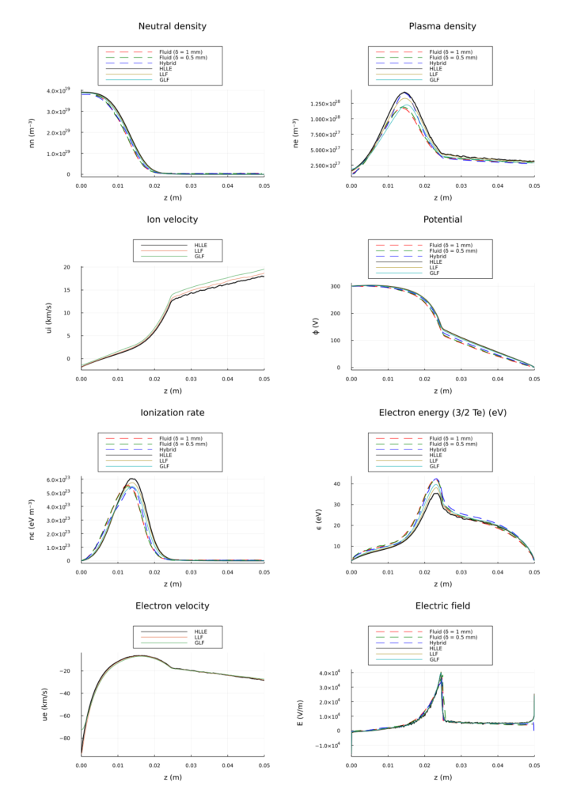
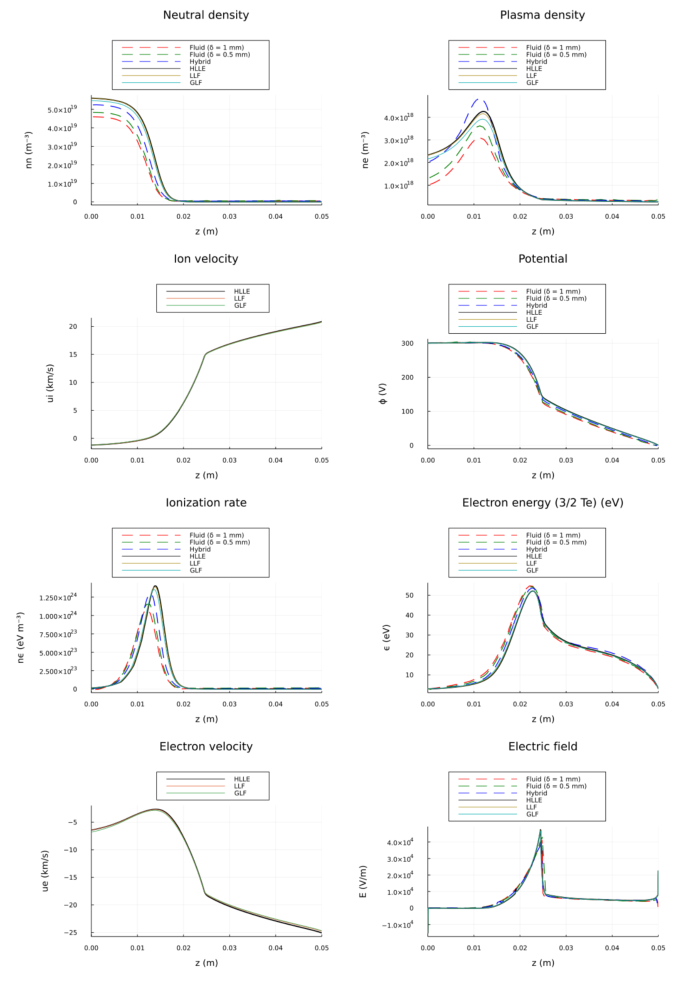
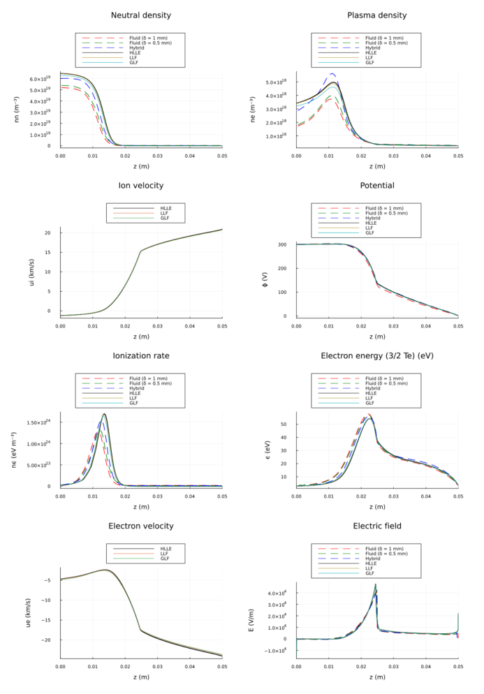

# Summary

Although the Hall effect thruster is  one of the most widely-used forms of in-space electric propulsion, there are aspects of these devices---particularly the electron dynamics---that remain poorly understood.   This knowledge gap has precluded the development of fully predictive engineering models for Hall thruster operation.   Instead, it is  necessary to calibrate models against experimental data in order to achieve a high degree of agreement with data.   This process is  time intensive for state of the art multi-dimensional Hall thruster models and can be subject to a high degree of variability.  HallThruster.jl is a one-dimensional fluid Hall thruster code code which has sufficient fidelity to be partially predictive, while running quickly enough to be used as a surrogate for model calibration and discovery. It is written in Julia for its combination of speed, extensibility and ease-of-use, and it allows users to customize many aspects of the simulation including the critical model for the electron dynamics.

# Statement of need

The Hall effect thruster is an  annular plasma device characterized by an electric field  applied across a radial magnetic field . \autoref{fig:hallthruster} depicts the operation of a typicall Hall thruster.

The heavier, unmagnetized ions are accelerated by this electric field downstream at high speed while the electrons remain trapped in a strong, $E\times B$  azimuthal "Hall" current.  In an ideal, collisionless environment, these trapped electrons are not able to cross the confining magnetic field.  In practice, however, there is a high degree of electron flux across the magnetic field lines, perpendicular to the applied magnetic field. The process, which is a critical driver for the overall dynamics of the thruster, is not well understood. `HallThruster.jl` was designed as a tool to more rapidly assess different  models for this electron transport through parameter estimation, uncertainty quantification, and surrogate optimization.   It allows users to alter many parts of the physics model for electron transport (and related processes) without modifying the source code of the package, and the one-dimensional domain only requires a few seconds to a few minutes to run a simulation, depending on the grid resolution. With that said, a central premise of Hallthruster.jl is that the dynamics in the Hall thruster are suitably one-dimensional that the 1D code is usually sufficient for an accurate approximation of a 2D or 3D code when run on the scale of the entire thruster.  But, we note that with appropriate calibration, errors may be corrected by training a surrogate model correction for higher dimensional codes.  Indeed, this is one of the anticipated use cases.

While one-dimensional codes are commonly used in Hall thruster research [@boeuf1998; @ahedo2001; @haraquasineutralfluid; @sahu_ffm; mikellides_1D],  `HallThruster.jl` is unique in that, in addition to its primary goal of informing closure models, it is written from the ground up with a strong emphasis on code verification, collaboration, and extension.  As an open source code, our goal is that it will allow the community to reproduce computational results obtained and to compare and contrast with parallel studies.

# Physics model

\autoref{fig:domain} depicts the one-dimensional simulation domain for HallThruster.jl.  In this model, we assume quasineutrality in the entire domain and treat all species---neutrals, ions, and electrons--- as fluids.  Neutrals are assumed to have constant temperature and velocity and are solved using the continuity equation, while ions are assumed isothermal and are modeled using the isothermal Euler equations. Electron inertia is neglected, so the electron momentum equation reduces to a generalized Ohm's law.  As discussed in the preceding section, electrons drift primarily in the $\hat{\theta} = \hat{z} \times \hat{r}$ direction but have a small axial drift enabled by collisions. This cross-field electron current observed in experiment is much higher than that which would be predicted from classical collisions alone, so we apply an additional "anomalous" collision frequency in the Ohm's law to enable the user to better tune the simulation to match experiment.  Different forms for this collision frequency can be specified to explore different closure models. We  combine this Ohm's law with current conservation to obtain a second-order partial differential equation for the electrostatic potential. Lastly, we solve a partial differential equation for the transport of electron internal energy, taking into account losses due to ionization, excitation, and wall losses. A detailed listing of the equations employed in the physics model is available in the code documentation.

While many aspects of Hall thruster physics are well-represented by a one-dimensional model, certain important features of real Hall thruster discharges will not be captured in such a simplified code. Among other effects, the most important of these missing features are plume divergence, impacts of magnetic field curvature, and effects of radial plasma non-uniformity on wall losses.

# Numerics

The finite volume method is applied to discretize the ion and neutral equations, transforming them into a system of ordinary differential equations. These are integrated in time using `DifferentialEquations.jl` [@rackauckas2017differentialequations], and all explicit integrators that work with `DifferentialEquations.jl` should work in `HallThruster.jl`. Several choice of numerical flux are available, including the Rusanov, global Lax-Friedrichs, and Hartford-Lax-van-Leer-Einfeld (HLLE) fluxes.  The elliptic equation for the potential is transformed by finite differences into a tridiagonal linear system and solved using Thomas' algorithm [@thomas1949elliptic]. The electron energy equation is solved semi-implicitly to ease timestep restrictions and is discretized in space using first-order upwind differences. We compute reaction and collision rate coefficients using look-up tables. The method of manufactured solutions is used to verify that we have correctly discretized the PDEs and obtain the design order of accuracy. We are aided in this by the `Symbolics.jl` [@gowda2021high], which makes computation of the needed source terms simple.

# Functionality

HallThruster.jl provides extensive options to allow the user to customize their simulation. These include

- Custom (one-dimensional) thruster geometry
- Anode and wall sheath model options
- Multiple propellants--the code has built-in capabilities for krypton and xenon.  Additional propellants can be added by introducing the appropriate reaction rates and mass
- Restarts
- Custom anomalous transport models
- User-provided source terms
- Custom additional collisions/reactions

Detailed documentation about all of these features is available at the Github repository (https://github.com/UM-PEPL/HallThruster.jl). More features will  be added as the code continues to develop, and the authors welcome contributions and ideas from users.

# Example simulations

We show comparisons of our results to case 3 of the LANDMARK benchmark [@landmarkplasma], which provides reference 1D Hall thruster simulations to which code authors can compare their own simulations. This benchmark has three cases, distinguished by the amount of electron energy lost to the walls. We show all results with 1024 cells, time averaged after 2 ms of simulation time. We compare three included fluxes: HLLE, local Lax-Friedrichs / Rusanov (LLF), and global Lax-Friedrichs (GLF) to the three sub-cases of the LANDMARK benchmark - two fluid models with adjustable viscosity parameter $\delta$ and a hybid-particle-in-cell case. Note that the benchmark does not include plots of the ion and electron velocities, nor does it include details about the numerics of the example case. This makes a quantitative comparison difficult. Nevertheless, we see good qualitative agreement. Differences between our model and the LANDMARK fluid model may be related to differences in boundary condition implementation, order of accuracy of method, or choice of numerical flux.

## LANDMARK case 1:

## LANDMARK case 2:

## LANDMARK case 3:

# Acknowledgements

T. Marks and B. Jorns were supported by  AFOSR grant FA9550-19-1-0022 under the Space Propulsion and Power portfolio.   P. Schedler was supported under a research grant from ETH Zurich, Zurich, Switzerland.

# References
